# Práctica 3 de Interfaces Inteligentes: Físicas en Unity
## Autor
* Nombre: Juan Rodríguez Suárez
* Correo: alu0101477596@ull.edu.es
## Descripción simulación desde el editor
### 1.-
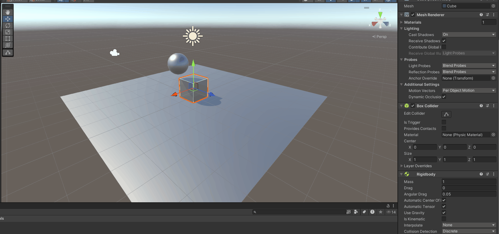
* **Plano**: Collider
* **Esfera**: Collider
* **Cubo**: Rigidbody + Collider
Se observa que ni el plano ni la esfera tienen un componente Rigidbody, por lo que no se ven afectados por la gravedad. El cubo, sin embargo, sí tiene un componente Rigidbody, por lo que cae al suelo aunque no se aprecia porque ya está apoyado en el suelo (colisiona con el plano).
### 2.-
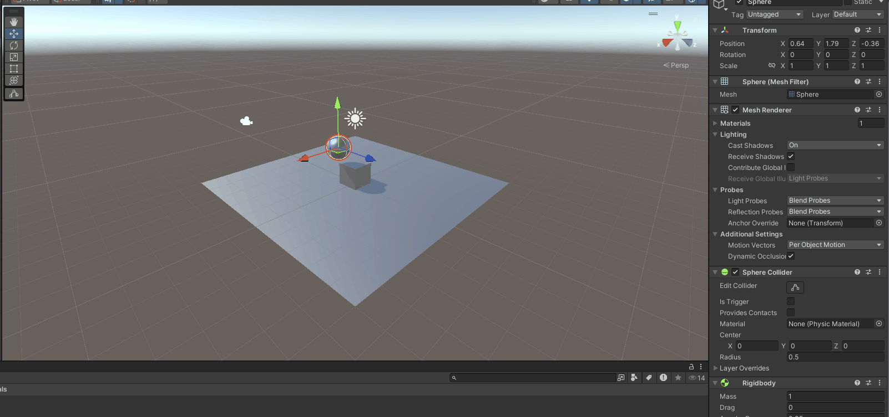
* **Plano**: Collider
* **Esfera**: Rigidbody + Collider
* **Cubo**: Rigidbody + Collider
En este caso, tanto el cubo como la esfera, al ser Rigidbody, se ven afectados por la gravedad y colisionan con el plano por su collider y la esfera con el cubo y después con el plano.
### 3.-
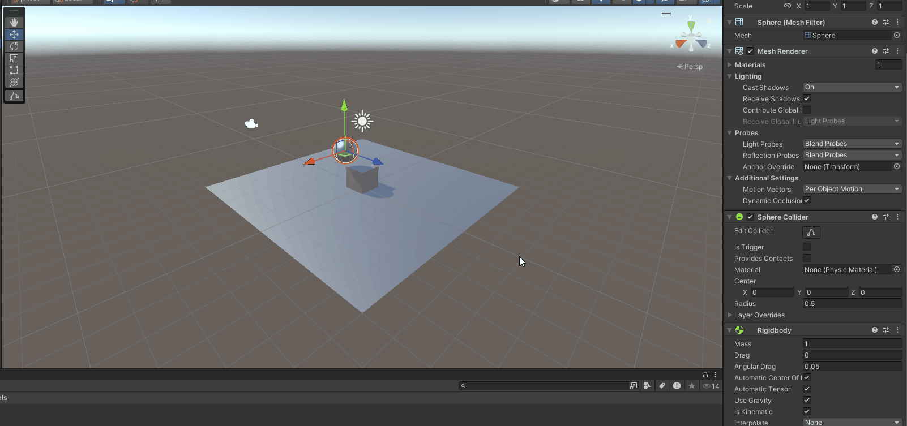
* **Plano**: Collider
* **Esfera**: Rigidbody (cinemático) + Collider
* **Cubo**: Rigidbody + Collider
En este caso, la esfera tiene un componente Rigidbody pero está marcado como cinemático, por lo que no se ve afectada por la gravedad.
### 4.-
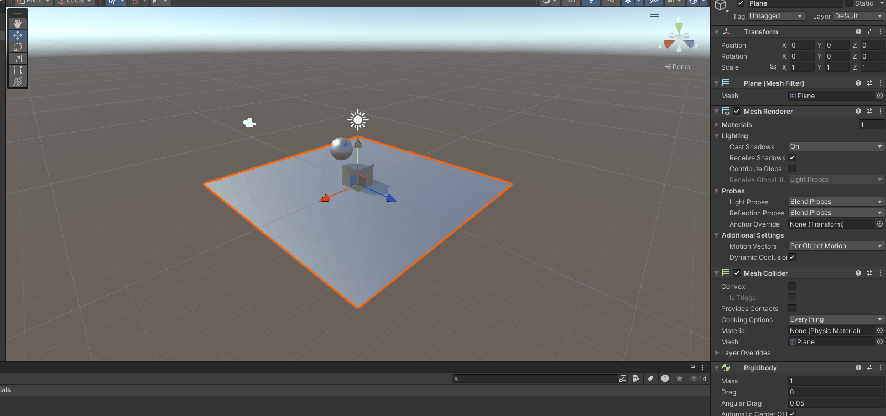
* **Plano**: Rigidbody + Collider
* **Esfera**: Rigidbody + Collider
* **Cubo**: Rigidbody + Collider
Todos los objetos al tener un Rigidbody se ven afectados por la gravedad y caen al vacío.
### 5.-
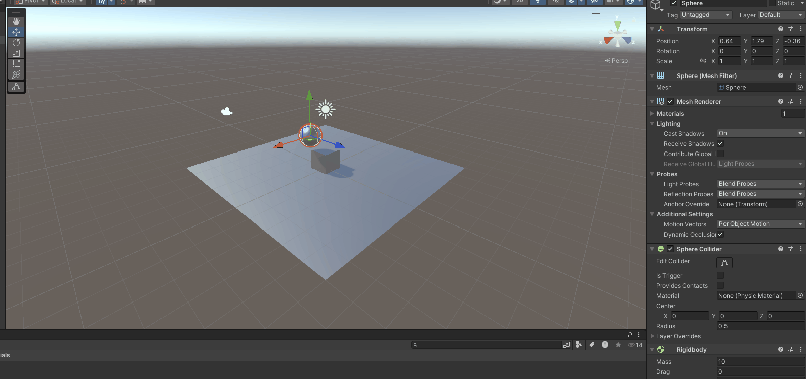
* **Plano**: Rigidbody + Collider
* **Esfera**: Rigidbody + Collider (10 veces más masa que el cubo)
* **Cubo**: Rigidbody + Collider
Pasa lo mismo que en el caso anterior, pero la esfera tiene 10 veces más masa pero cae a la misma velocidad que el cubo debido a las leyes de la física newtoniana. *F = m * a* que es igual a *F = m * g* en este caso, por tanto: *a = g* independientemente de la masa.
### 6.-

* **Plano**: Rigidbody + Collider
* **Esfera**: Rigidbody + Collider (100 veces más masa que el cubo)
* **Cubo**: Rigidbody + Collider
Lo mismo que en el caso anterior por las mismas razones.
### 7.-
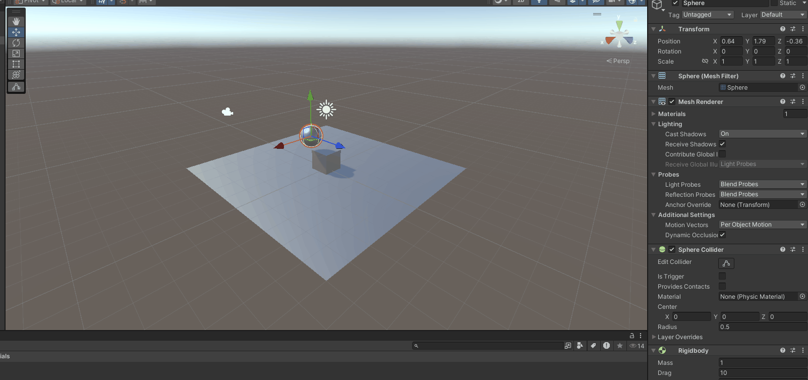
* **Plano**: Rigidbody + Collider
* **Esfera**: Rigidbody + Collider (fricción de 10)
* **Cubo**: Rigidbody + Collider
Al tener fricción, la esfera se desplaza más lentamente que el resto.
### 8.-
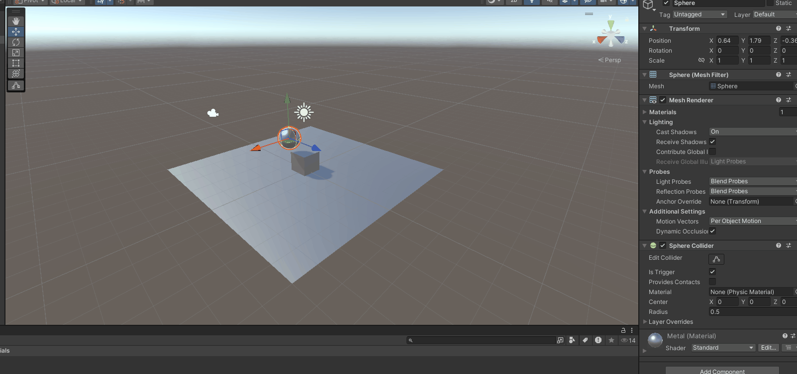
* **Plano**: Rigidbody + Collider
* **Esfera**: Collider (trigger)
* **Cubo**: Rigidbody + Collider
Al ser un trigger, la esfera no colisiona con el cubo ni con el plano y no cae al vacío porque no tiene un componente Rigidbody.
### 9.-
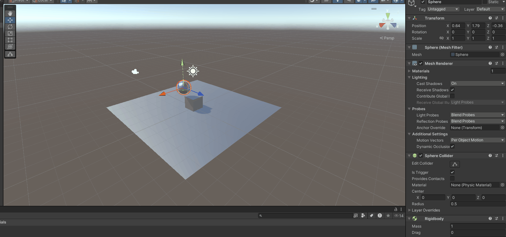
* **Plano**: Rigidbody + Collider
* **Esfera**: Rigidbody + Collider (trigger)
* **Cubo**: Rigidbody + Collider
Al ser un trigger, la esfera no colisiona con el cubo ni con el plano, por lo que cae al vacío pero manda mensajes de colisión.
## Descripción scripts
### 1.-
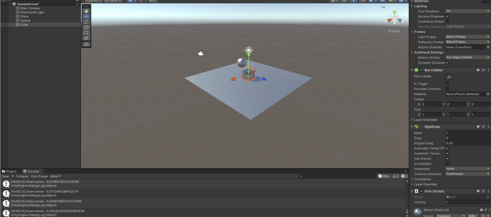
Se comprueba para cada eje vertical y horizontal si son mayores o menores que 0 y se imprime el valor por la velocidad y la tecla pulsada.
### 2.-
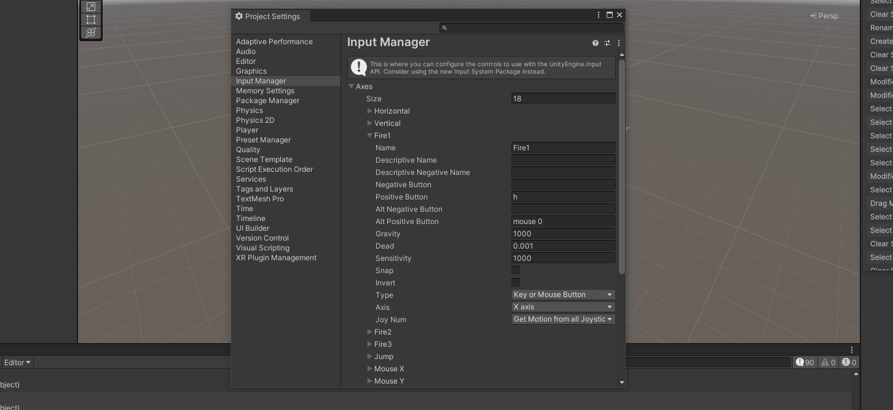
Se edita la tecla asociada al eje en Edit -> Project Settings -> Input Manager.
### 3.-
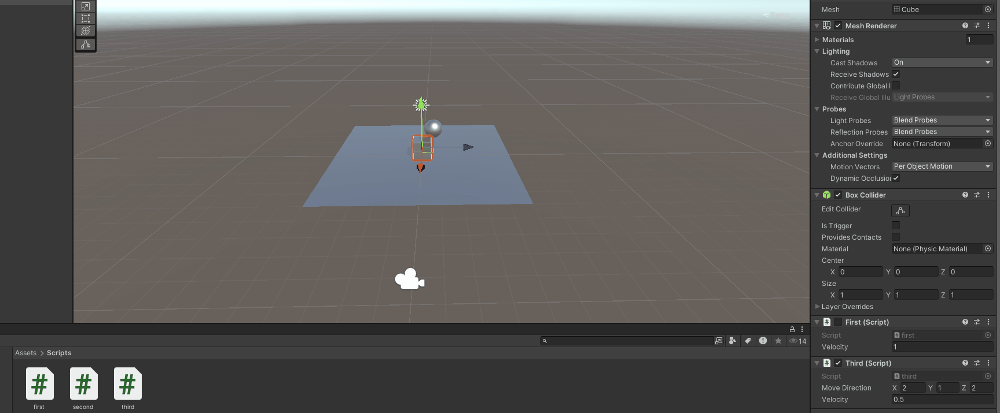
* **Duplicar las coordenadas de la dirección:** El cubo se mueve el doble de rápido en la dirección que se le indique por frame.
* **Duplicar la velocidad manteniendo al dirección de movimiento:** El cubo se mueve el doble de rápido en la dirección que se le indique por frame.
* **La velocidad que usas es menor que 1**: El cubo se mueve más lento por frame que lo indicado en el vector.
* **La posición del cubo tiene y>0**: El cubo se mueve en esa dirección pero empieza a moverse desde más arriba.
* **Intercambiar movimiento relativo al sistema de referencia local y el mundial**: El cubo se mueve en la dirección que se le indica pero en el sistema de referencia local.
### 4 y 5.-
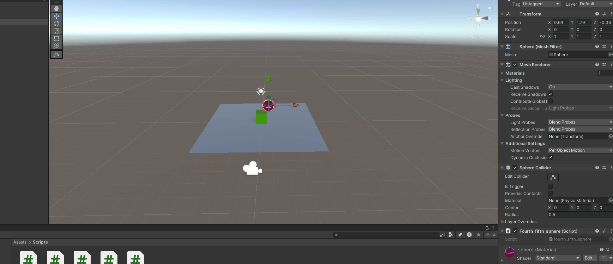
Se crean dos scripts, uno para el cubo donde se mueve solo si se pulsa las teclas asociadas al eje horizontal y vertical y otro para la esfera que se mueve según detecta las teclas WASD. Para hacerlo proporcional al tiempo transcurrido entre frame y frame se multiplica por `Time.deltaTime`.
### 6.-
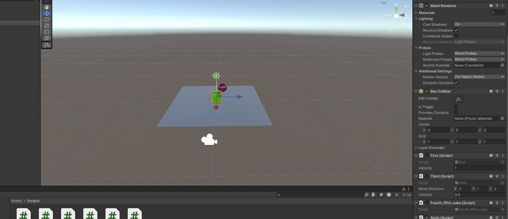
Se calcula el vector de la dirección restando de la posición de la esfera la posición del cubo y se normaliza. Se multiplica por deltaTime y se mueve el cubo en esa dirección.
### 7.-
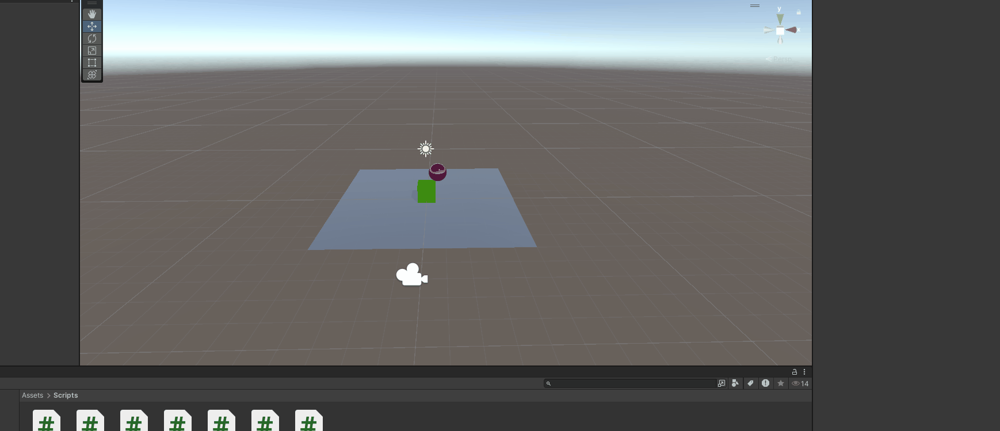
En cada frame se pone el cubo mirando a la esfera y lo desplazamos con el vector *forward* ya que es el que apunta hacia la esfera.
### 8.-
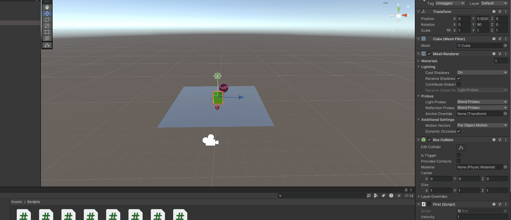
Se aplica una rotación que depende del eje horizontal y se rota sobre el eje Y. Luego se mueve en la dirección que apunta el vector *forward*.
### 9.-
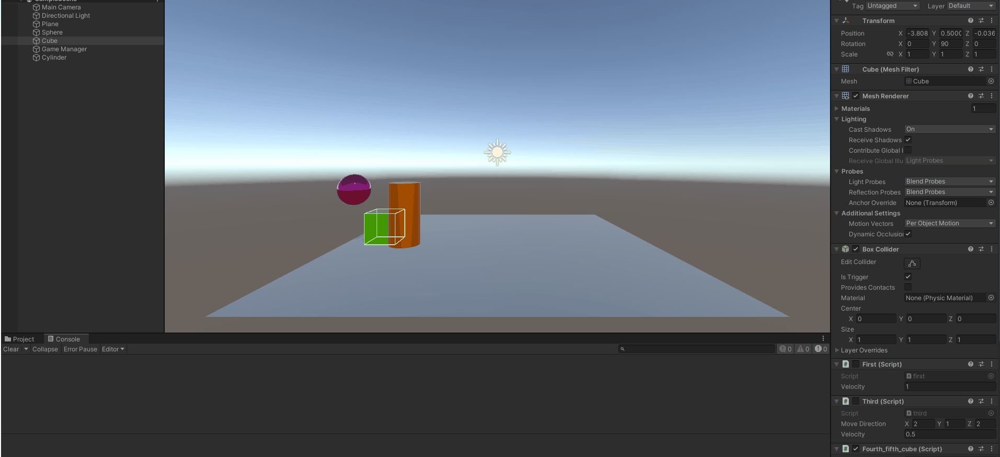
Se han definido los colliders para la esfera y cubo como triggers ya que los vamos a mover con el *transform* y no con el motor de físicas pero queremos que detecten colisiones. El cilindro es un objeto con collider y rigidbody y le asociamos un script con la función `OnTriggerEnter` que imprime un mensaje cuando detecta una colisión de alguno de los dos objetos.
### 10.-
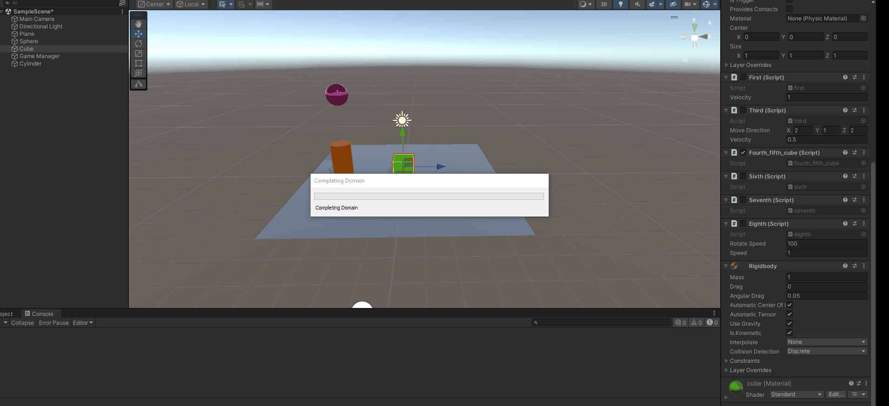
En lugar de OnTriggerEnter, se usa OnCollisionEnter para detectar colisiones ya que si miramos en la documentación de Unity, `OnCollisionEnter` se llama cuando un objeto colisiona con otro objeto que tiene un collider y un rigidbody. `OnCollisionEnter` se llama cuando un objeto con rigidbody y collider colisiona con cualquier otro tipo de elemento físico.
### 11.-
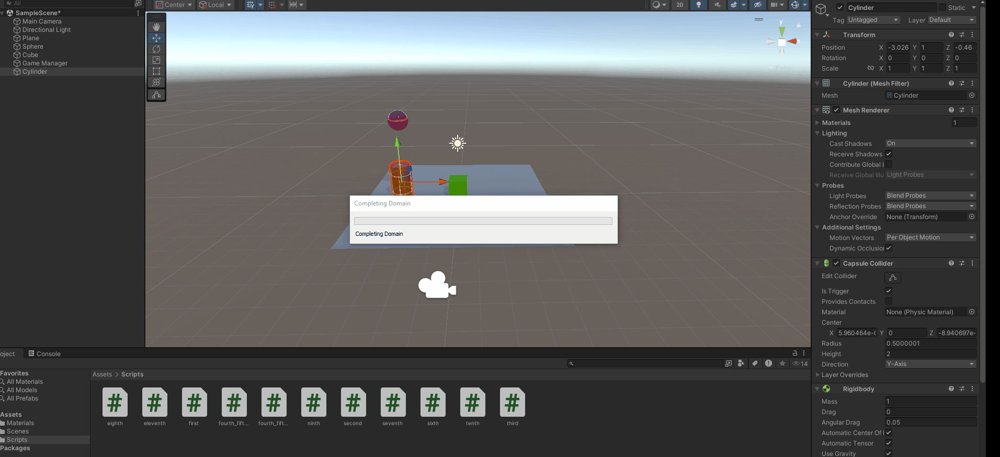
Si de nuevo miramos en la documentación, se observa que la columna de los triggers asociada con Rigidbody Trigger Collider emite un mensaje cuando cualquier otro objeto con collider (sea cual sea) colisiona con el objeto que tiene el script. Por esto, se usará `OnTriggerEnter` para detectar colisiones con los otros dos objetos.
### 12.-
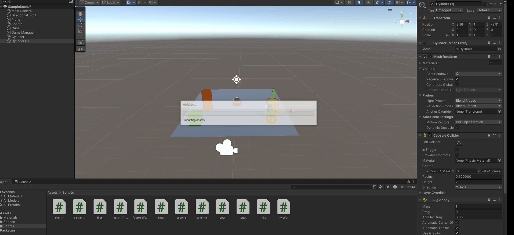
Para crear el movimiento, dado que es un objeto físico y no se puede usar el *transform*, se usa el método `AddForce` que aplica una fuerza en la dirección que se le indica (la de los ejes de movimiento). Se multiplica por `Time.deltaTime` para que sea proporcional al tiempo transcurrido entre frame y frame.
* **Masa esfera = 1**: Si movemos el cilindro a la esfera la mueve sin problemas.
* **Masa esfera = 10xcilindro**: Si movemos el cilindro a la esfera la mueve pero con más dificultad.
* **Masa esfera = 1/10xcilindro**: Si movemos el cilindro a la esfera la mueve con facilidad.
* **Esfera cinemática**: No es afectada por el cilindro pero esta sí afecta al cilindro (no dejándolo moverse).
* **Esfera trigger**: Cae al vacío sin colisionar con el cilindro porque no detecta colisiones con el plano y se cae por el Rigidbody.
* **Fricción cilindro x2**: El ciliindro se mueve más lentamente.
* **Fricción cilindro x0.5**: El cilindro se mueve más rápido por la menor resistencia del plano.